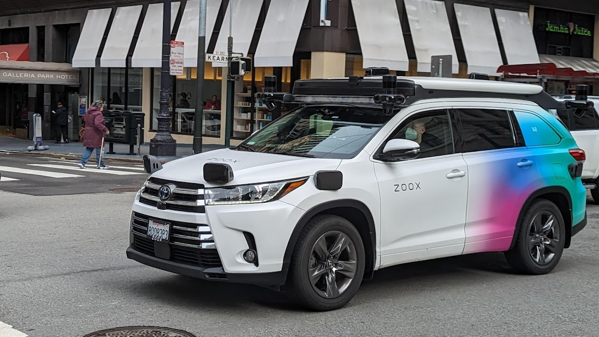
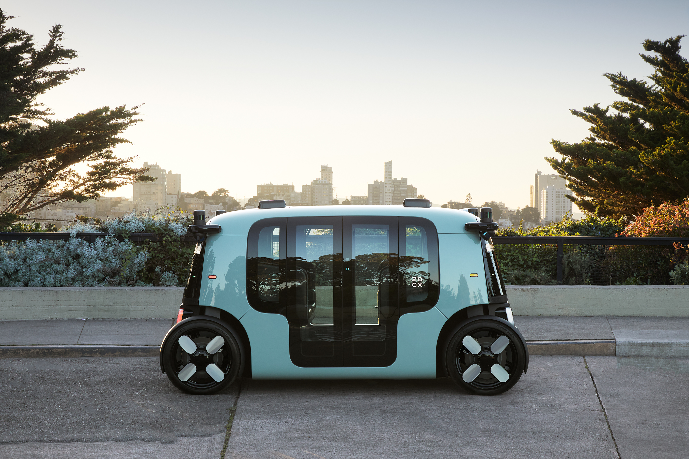

<!-- 
# title: An autonomous future may be closer than I thought
# description: I explore the development of autonomous driving technology over the years, and share with you my experience of its development in San Francisco.
# seo-description: Connor Jarrett looks into the development of autonomous driving technology over the years, and looks at the technology we have today.
# category: Future tech
# keywords: autonomous vehicles, autonomous transportation, San Francisco, vehicle development, future technology, new cars, vehicle developments, autopilot, self driving cars, car technology, autonomous driving, san francisco
# image: robotaxi.jpg
# date: 2023-6-13
-->
It's been a bit longer than normal since I last posted, but that's because I've been working on a few exciting new things. Today, I'm going to look at autonomous vehicles that I saw in San Francisco, and how the technology behind them was much further along than I thought it was, It's really exciting stuff.

## The history of autonomous vehicles
Cars that drive themselves have been a dream of people forever, but only in the last 10 years has that technology become something viable for mass markets.

Before this, you could get cruise control, automatic lane switching and automatic parking, but never really a full package. Even now, we are limited by laws in lots of places that prevent fully driverless driving.

Tesla really brought the autonomous vehicle to the mass market in 2014, with their announcement of Autopilot, but even this wasn't intended for fully autonomous driving, and as more of a do-it-all assistant for the driver. For most people, a Tesla is as close as it gets to being able to experience the potential future of not having to be at the wheel.

## The law
In lots of places, the law is what stops the development of self-driving technology coming to mass markets. In the EU, to my knowledge, fully driverless cars are still not legal, and for the driver to not be present in the vehicle, they must be within a few metres of the vehicle.

## What I saw in San Francisco
When I visited San Francisco in April, I was blown away by the amount of experimental technology under development. 

The streets were littered of cars with sensors strapped on them, some looking like very early projects, while others looked near completion. Lots of these cars have people inside collecting mapping and driving data, while others had no one in them at all. Some were on the highway, while others were just driving in the city.

I'm going to show you one of the companies I saw, which was by far the most prominent while I was there. I've always been fascinated by this technology, so I've really tried to research as much as I can about the technologies behind them.

## [Zoox](https://zoox.com)
Zoox was founded in 2014 by Jesse Levinson and Tim Kentley-Klay in California, and they had a vision, not to convert an existing car to be autonomous, but to build a rider-first vehicle with social seating at the core of its design.

In 2015, they had their first prototype with and made their first autonomous drive. In 2019, Zoox got a new CEO, Aicha Evans. Aicha Evans had previously held various senior leadership positions at Intel, including Chief Strategy Officer.

4 years later, in 2020, they were acquired by Amazon and revealed their very own vehicle, the Robotaxi. The Robotaxi had been in development for years, and this was the first time that people outside of Zoox got to see it.

This year, in 2023, their robotaxi took its very first completely autonomous journey on open public roads. While I didn't see one of their production vehicles in person, I witnessed a lot of their test cars driving around collecting data.

Zoox vehicles have a multitude of sensors on them, including LiDAR, Radar and Cameras to see, and understand its surroundings. Their sensors reportedly can see over 150 meters away in all directions, with a 360 degree field of view. They use purpose-built geometric and semantic maps to understand where they are going, and what they should expect to see on the way (such as traffic lights).

<iframe class="youtube" src="https://www.youtube-nocookie.com/embed/ga8D0Ezgydw"></iframe>

On their YouTube channel, Zoox has over 50 videos of their autonomous driving in action, showing both a dashcam view and a computer interpreted view. It's very interesting. [Have a look](https://www.youtube.com/watch?v=4hs_vUiQrT0&list=PL-jMwLfqzVRjS0GXcrVI-7vw7EE0KauW6).

## Conclusion
Coming from the UK, so much of this technology was a shock, and I wasn't expecting to see any of it. I'm incredibly impressed by how far companies like Zoox have reached, and from what I saw in person and online, the future we all dreamed of might be closer than we thought.